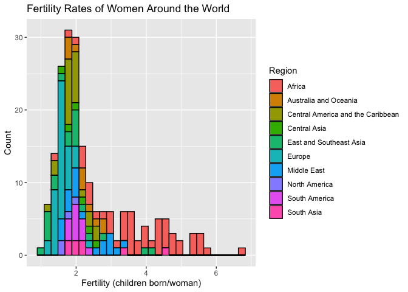

Index
================

This is an [R Markdown](http://rmarkdown.rstudio.com) Notebook. When you
execute code within the notebook, the results appear beneath the code.

Try executing this chunk by clicking the *Run* button within the chunk
or by placing your cursor inside it and pressing *Cmd+Shift+Enter*.

``` r
Glink="https://github.com/543-Van-Deliverables/Deliverable-2/raw/main/"
Flink="CountryRankingFinal.csv"
CRF=read.csv(paste0(Glink,Flink))
```

``` r
names(CRF)
```

    ##  [1] "Name"             "Birth"            "Region"           "Energy"          
    ##  [5] "CarbonDioxide"    "Fertility"        "IndustrialGrowth" "Laborforce"      
    ##  [9] "LifeExpectancy"   "Unemployment"

``` r
summary(CRF$Fertility)
```

    ##    Min. 1st Qu.  Median    Mean 3rd Qu.    Max. 
    ##   1.080   1.700   2.010   2.462   2.920   6.820

``` r
library(ggplot2)
base=ggplot(data=CRF, aes(x=Region, y=Fertility))
base+geom_boxplot() + theme(axis.text.x = element_text(angle = 90,size = 8,vjust = .5))
```

<!-- -->

``` r
tapply(CRF$Fertility,CRF$Region, summary)
```

    ## $Africa
    ##    Min. 1st Qu.  Median    Mean 3rd Qu.    Max. 
    ##   1.350   2.980   3.800   3.847   4.620   6.820 
    ## 
    ## $`Australia and Oceania`
    ##    Min. 1st Qu.  Median    Mean 3rd Qu.    Max. 
    ##   1.730   1.965   2.240   2.266   2.540   2.870 
    ## 
    ## $`Central America and the Caribbean`
    ##    Min. 1st Qu.  Median    Mean 3rd Qu.    Max. 
    ##   1.240   1.718   1.895   1.917   2.053   2.620 
    ## 
    ## $`Central Asia`
    ##    Min. 1st Qu.  Median    Mean 3rd Qu.    Max. 
    ##   1.600   1.805   2.070   2.070   2.365   2.500 
    ## 
    ## $`East and Southeast Asia`
    ##    Min. 1st Qu.  Median    Mean 3rd Qu.    Max. 
    ##   1.080   1.340   1.825   1.952   2.098   4.210 
    ## 
    ## $Europe
    ##    Min. 1st Qu.  Median    Mean 3rd Qu.    Max. 
    ##   1.220   1.480   1.565   1.601   1.688   2.290 
    ## 
    ## $`Middle East`
    ##    Min. 1st Qu.  Median    Mean 3rd Qu.    Max. 
    ##   1.640   1.805   1.930   2.309   2.880   3.440 
    ## 
    ## $`North America`
    ##    Min. 1st Qu.  Median    Mean 3rd Qu.    Max. 
    ##   1.570   1.653   1.760   1.748   1.855   1.900 
    ## 
    ## $`South America`
    ##    Min. 1st Qu.  Median    Mean 3rd Qu.    Max. 
    ##   1.760   1.867   1.995   2.009   2.185   2.330 
    ## 
    ## $`South Asia`
    ##    Min. 1st Qu.  Median    Mean 3rd Qu.    Max. 
    ##   1.710   1.873   2.035   2.456   2.440   4.620

``` r
titleText="Fertility Rates of Women Around the World"

baseflip=base + geom_boxplot() + 
        labs(title = titleText)

baseflip  + coord_flip()
```

<!-- -->

``` r
baseHY=ggplot(data=CRF,aes(x=Fertility)) 
histHY=baseHY + geom_histogram(aes(fill=Region), color='black')
histHY + ggtitle("Fertility Rates of Women Around the World") + labs(x="Fertility (children born/woman)",y="Count")  
```

    ## `stat_bin()` using `bins = 30`. Pick better value with `binwidth`.

<!-- -->

Add a new chunk by clicking the *Insert Chunk* button on the toolbar or
by pressing *Cmd+Option+I*.

When you save the notebook, an HTML file containing the code and output
will be saved alongside it (click the *Preview* button or press
*Cmd+Shift+K* to preview the HTML file).

The preview shows you a rendered HTML copy of the contents of the
editor. Consequently, unlike *Knit*, *Preview* does not run any R code
chunks. Instead, the output of the chunk when it was last run in the
editor is displayed.
